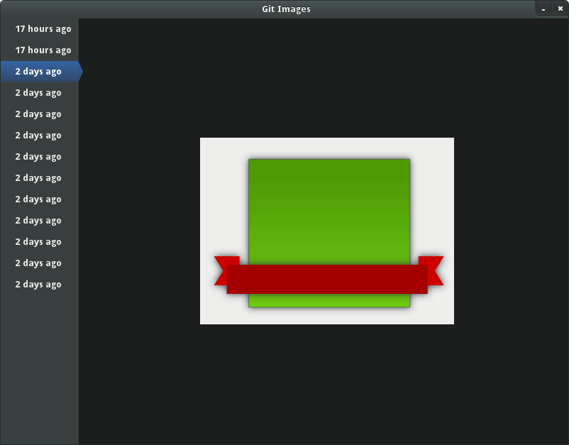

git-image-viewer
================

Lets you view all the revisions of a particualar SVG file in a git repo.

Still very rough. Might take a while when first loading the file, as it 
currently uses inkscape to generate PNGs 

## Usage ##

```python git-image-viewer.py "/home/dudemcpants/gitrepo/myfile.svg"```

## Screenshot ##



